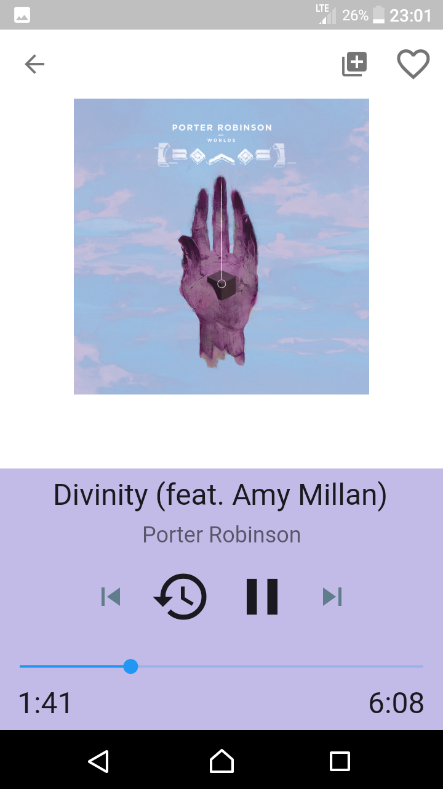
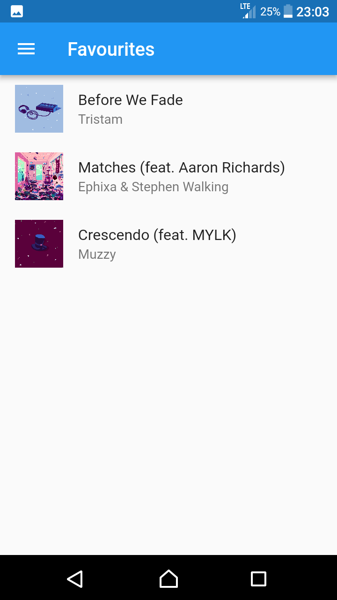
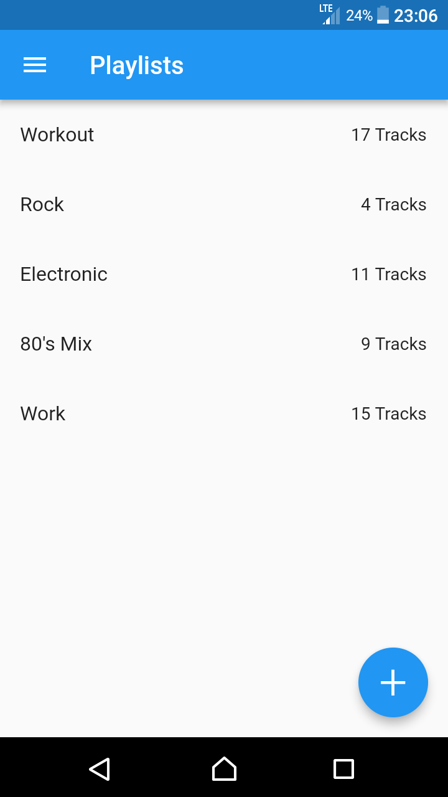

# Nano Music Player 

Simple local music player built with flutter. It uses the [audioplayer](https://pub.dartlang.org/packages/audioplayer#-readme-tab-) plugin to play files, and [path_provider](https://pub.dartlang.org/packages/path_provider#-readme-tab-) to locate the external directory and search it for playable files. Metadata is gathered through native java code. I also used this [Waves widget](https://github.com/i-protoss/wave). You can download the app from [Google Play](https://play.google.com/store/apps/details?id=janhrastnik.musicplayer2).

# Screenshots

## Getting Started

For help getting started with Flutter, view our online
[documentation](https://flutter.io/).
